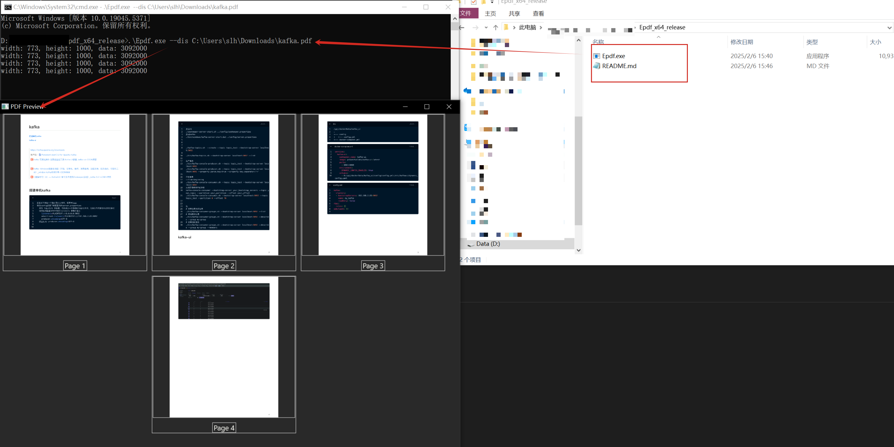
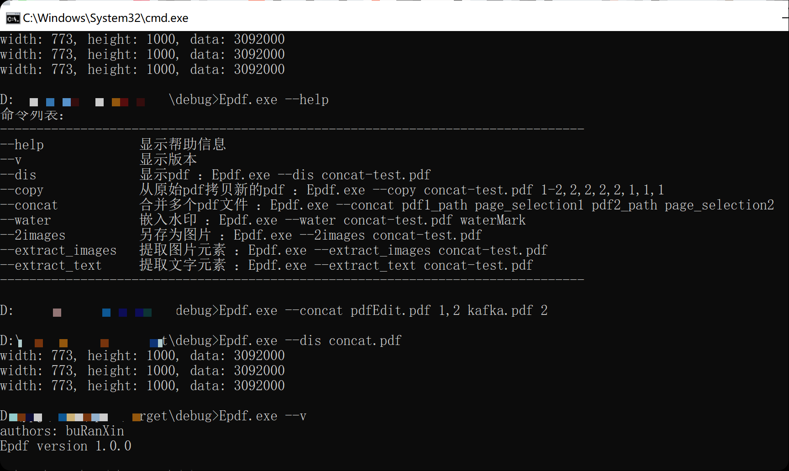

# Epdf
PDF editor written in rust, under development
> csdn: https://blog.csdn.net/qq_38234785/article/details/145475894?spm=1001.2014.3001.5501
> github: https://github.com/dog-tired/Epdf

<center>
    <br/>
    <span>软件使用</span>
</center>
<center>
    <br/>
    <span>软件使用</span>
</center>

- --help: 显示帮助信息
- --dis 显示pdf ：
    - Epdf.exe --dis concat-test.pdf
- --copy 新建pdf ：
    - Epdf.exe --copy concat-test.pdf 1-2,2,2,2,2,1,1,1
- --water 加水印 : 
    - Epdf.exe --water concat-test.pdf waterMark
- --2images 转图片: 
    - Epdf.exe --2images concat-test.pdf
- --extract_images 提取图片元素:
    - Epdf.exe --extract_images your_pdf_file.pdf
- --extract_text 提取文本元素:
    - Epdf.exe --extract_text your_pdf_file.pdf
- --concat 合并pdf:
    - Epdf.exe --concat pdfEdit.pdf 1,2 kafka.pdf 2
- --images_2_pdf 文件夹中图片合成pdf（图片名称为数字，合成时按照序号顺序）:
    - Epdf.exe --images_2_pdf folder_path

# 项目说明
项目打包
```bash
cargo build --release     
```


# Epdf

Epdf 是一款用 Rust 编写、仍在开发中的 PDF 编辑器。它解决了传统 PDF 编辑软件操作复杂、功能分散的痛点。借助 Rust 高性能、内存安全等特性，以命令行界面与用户交互。支持多种实用功能，如用 `--help` 显示帮助，`--dis` 显示 PDF，`--copy` 新建 PDF，`--water` 加水印，还能进行文件与图片的相互转换、元素提取及文件合并等。适用于办公场景下的文件处理、设计场景的图片提取创作，以及学习场景的资料整理查看等，用户通过简单命令即可高效完成各类 PDF 操作，节省时间与精力。 

## 命令行选项

### --help
显示帮助信息，帮助用户快速了解软件的使用方法。
- **参数含义**：无额外参数，使用该选项时仅输入 `Epdf.exe --help` 即可触发显示帮助信息。

### --dis 显示pdf
通过该选项，用户可以指定要显示的 PDF 文件。例如：
```sh
Epdf.exe --dis your_pdf_path
```
- **参数含义**：
    - `--dis`：该选项用于触发显示 PDF 文件的功能。
    - `your_pdf_path`：指定要显示的 PDF 文件的路径，可以是相对路径（相对于 `Epdf.exe` 所在目录）或绝对路径。

### --copy 新建pdf
此选项用于新建一个 PDF 文件，你需要指定源 PDF 文件以及相关的页面选择参数。例如：
```sh
Epdf.exe --copy your_pdf_path page_selection
```
- **参数含义**：
    - `--copy`：该选项用于触发新建 PDF 文件的功能。
    - `your_pdf_path`：源 PDF 文件的路径，可以是相对路径或绝对路径。
    - `page_selection`：页面选择参数，格式可以是单个页码（如 `1`）、页码范围（如 `1 - 3`）或它们的组合（如 `1 - 2,4`），用于指定从源 PDF 文件中选取哪些页面来新建 PDF 文件。

### --concat 合并pdf
该选项可从指定的多个 PDF 文件合并成一个 PDF。使用示例：
```sh
Epdf.exe --concat pdf1_path page_selection1 pdf2_path page_selection2
```
- **参数含义**：
    - `--concat`：该选项用于触发合并 PDF 文件的功能。
    - `pdf1_path`、`pdf2_path` 等：参与合并的各个 PDF 文件的路径，可以是相对路径或绝对路径。
    - `page_selection1`、`page_selection2` 等：分别对应每个 PDF 文件的页面选择参数，格式同 `--copy` 选项中的 `page_selection`，用于指定从每个 PDF 文件中选取哪些页面参与合并。

### --water 加水印
使用该选项为指定的 PDF 文件添加水印。示例如下：
```sh
Epdf.exe --water your_pdf_path watermark_content
```
- **参数含义**：
    - `--water`：该选项用于触发为 PDF 文件添加水印的功能。
    - `your_pdf_path`：要添加水印的 PDF 文件的路径，可以是相对路径或绝对路径。
    - `watermark_content`：要添加到 PDF 文件中的水印内容，如文字、图案等（具体显示形式取决于软件实现）。

### --2images 转图片
该选项可将指定的 PDF 文件转换为图片。使用示例：
```sh
Epdf.exe --2images your_pdf_path width
```
- **参数含义**：
    - `--2images`：该选项用于触发将 PDF 文件转换为图片的功能。
    - `your_pdf_path`：要转换为图片的 PDF 文件的路径，可以是相对路径或绝对路径。
    - `width`：需要转换成图片的宽度，默认是1000。

### --extract_images 提取图片
该选项可从指定的 PDF 文件中提取图片。使用示例：
```sh
Epdf.exe --extract_images your_pdf_path
```
- **参数含义**：
    - `--extract_images`：该选项用于触发从 PDF 文件中提取图片的功能。
    - `your_pdf_path`：要从中提取图片的 PDF 文件的路径，可以是相对路径或绝对路径。

### --extract_text 提取文本
该选项可从指定的 PDF 文件中提取文本。使用示例：
```sh
Epdf.exe --extract_text your_pdf_path
```
- **参数含义**：
    - `--extract_text`：该选项用于触发从 PDF 文件中提取文本的功能。
    - `your_pdf_path`：要从中提取文本的 PDF 文件的路径，可以是相对路径或绝对路径。

### --images_2_pdf 文件夹中图片合成 pdf（图片名称为数字，合成时按照序号顺序）
该选项可将指定文件夹中的图片合成一个 PDF 文件，图片名称需为数字，合成时会按照序号顺序进行。使用示例：
```sh
Epdf.exe --images_2_pdf folder_path
```
- **参数含义**：
    - `-images_2_pdf`：该选项用于触发将文件夹中图片合成 PDF 文件的功能。
    - `folder_path`：包含要合成的图片的文件夹路径，可以是相对路径或绝对路径。